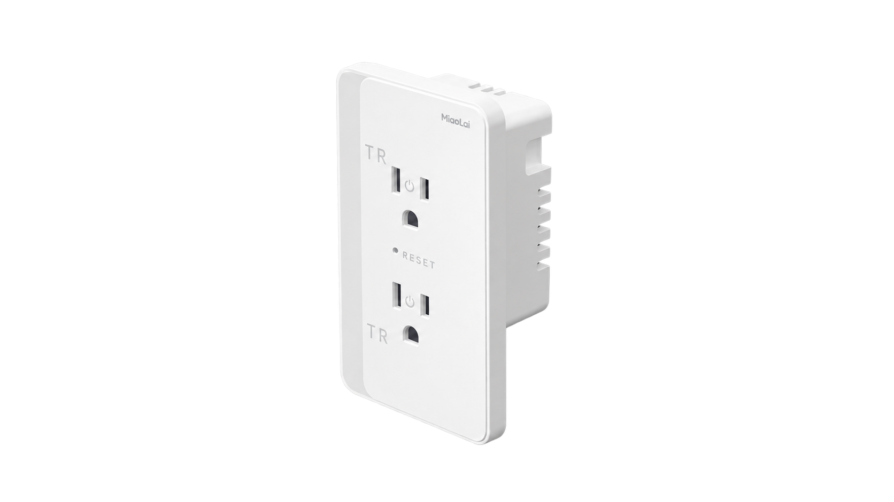
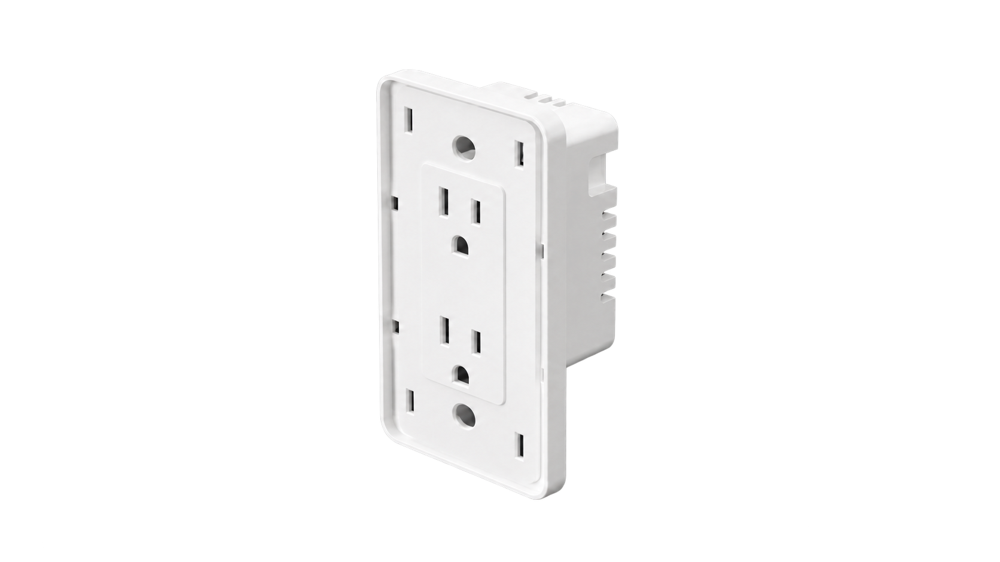
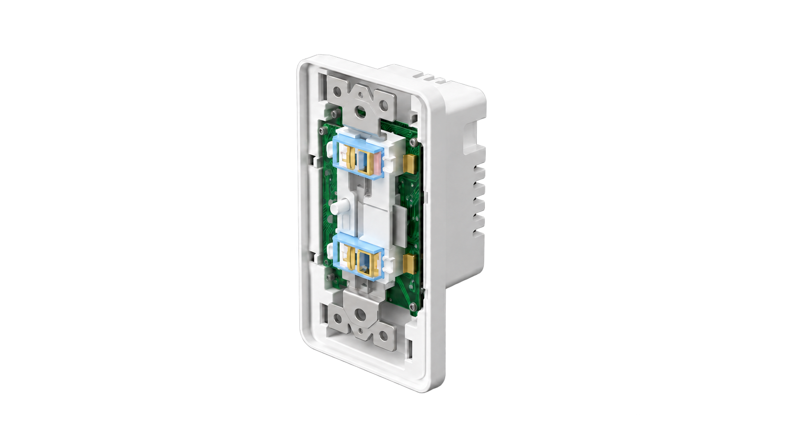
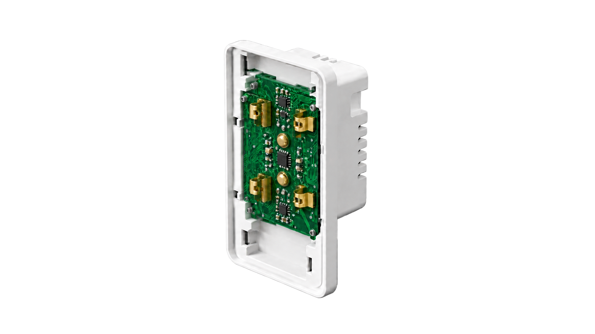

# scroll-product-wipe

一个复用产品滚动展示效果的 Codex skill：**滚动分屏 + 产品对齐 + 边界擦换**。

向下滚动时，新背景从底部进入；边界经过产品后，下半部露出下一状态，上半部仍显示上一状态。产品保持原位。

## 功能范围

- 使用用户提供的图片制作网页。
- 提供八种图片素材承接提示，供用户自行准备或生成图片。
- 不包含图片生成功能。
- 默认无可见文案，状态数量可调整。

## 安装与使用

将下面这句话直接发给 Codex：

```text
使用 skill-installer 安装 https://github.com/onlychuan/scroll-product-wipe 根目录的 skill。
```

也可手动安装：

```bash
git clone https://github.com/onlychuan/scroll-product-wipe.git ~/.codex/skills/scroll-product-wipe
```

将本仓库下载或克隆到 Codex 的 `~/.codex/skills/scroll-product-wipe` 目录，确保 `SKILL.md` 位于该目录根部。

示例请求：

> 使用 $scroll-product-wipe，把我提供的四张产品图做成产品保持居中、背景从下向上擦换的滚动页面，不要文案。

还没有图片时，先阅读 [八种素材提示](references/image-continuity.md)，自行准备图片后再制作页面。

## 墙插案例

直接打开 [examples/outlet/index.html](examples/outlet/index.html) 查看案例。四张透明 PNG 已包含在仓库中；页面无外部运行依赖。

| 完整外观 | 去掉面板 |
| --- | --- |
|  |  |
| 内部组件 | 电路板显露 |
|  |  |

此案例采用物体承接和形态承接。素材仅作为案例提供，不包含图片生成流程或上墙安装流程。

## 文件

- [SKILL.md](SKILL.md)：技能入口与实现约束。
- [references/image-continuity.md](references/image-continuity.md)：给用户的八种素材提示。
- [assets/template.html](assets/template.html)：可替换素材路径与背景色的简洁模板。
- [examples/outlet/](examples/outlet/)：当前网页及四张案例图片。

模板需配置用户图片后使用；墙插案例开箱可看。
